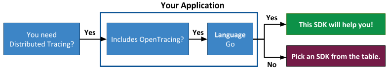

# wavefront-opentracing-sdk-go
[![build status][ci-img]][ci] [![Go Report Card][go-report-img]][go-report] [![GoDoc][godoc-img]][godoc] [](http://opentracing.io)

## Table of Content
* [Prerequisites](#Prerequisites)
* [Usage](#Usage)
  * [Application Tags](#1-Set-Up-Application-Tags)
  * [Wavefront Sender](#2-Set-Up-a-Wavefront-Sender)
  * [Reporter](#3-Set-Up-a-Reporter)
  * [WavefrontTracer](#4-Create-the-WavefrontTracer)
  * [Global Tracer](#5-Initialize-the-Global-Tracer)
* [Span Logs](#Span-Logs)
* [Cross Process Context Propagation](#Cross-Process-Context-Propagation)
* [RED Metrics](#RED-Metrics)
* [Monitoring the SDK](#Monitoring-the-SDK)
* [License](#License)
* [How to Contribute](#How-to-Contribute)

# Welcome to Wavefront's OpenTracing Go SDK
This is the Wavefront by VMware OpenTracing SDK for Go that provides distributed tracing support for Wavefront.

**Before you start implementing, let us make sure you are using the correct SDK!**



>  <b><i>Note</i></b>:
> </br>
>  * <b>This is the Wavefront by VMware OpenTracing SDK for Go!</b>
> If this SDK is not what you were looking for, see the <a href="#wavefront-sdks">table</a> given below.
> * See <a href="https://docs.wavefront.com/tracing_instrumenting_frameworks.html">instrument your application for tracing</a> for more information.

#### Wavefront SDKs
<table id="SDKlevels" style="width: 100%">
  <tr>
    <th width="10%">SDK Type</th>
    <th width="45%">SDK Description</th>
    <th width="45%">Supported Languages</th>
  </tr>
  <tr>
    <td><a href="https://docs.wavefront.com/wavefront_sdks.html#sdks-for-collecting-trace-data">OpenTracing SDK</a></td>
    <td align="justify">Implements the OpenTracing specification. Lets you define, collect, and report custom trace data from any part of your application code. <br>Automatically derives RED metrics from the reported spans. </td> 
    <td>
    <ul>
    <li>
      <b>Java</b>: <a href ="https://github.com/wavefrontHQ/wavefront-opentracing-sdk-java">OpenTracing SDK</a> <b>|</b> <a href ="https://github.com/wavefrontHQ/wavefront-opentracing-bundle-java">Tracing Agent</a>
    </li>
    <li>
      <b>Python</b>: <a href ="https://github.com/wavefrontHQ/wavefront-opentracing-sdk-python">OpenTracing SDK</a>
    </li>
    <li>
      <b>Go</b>: <a href ="https://github.com/wavefrontHQ/wavefront-opentracing-sdk-go">OpenTracing SDK</a>
    </li>
    <li>
      <b>.Net/C#</b>: <a href ="https://github.com/wavefrontHQ/wavefront-opentracing-sdk-csharp">OpenTracing SDK</a>
    </li>
    </ul>
    </td>
  </tr>

  <tr>
    <td><a href="https://docs.wavefront.com/wavefront_sdks.html#sdks-for-collecting-metrics-and-histograms">Metrics SDK</a></td>
    <td align="justify">Implements a standard metrics library. Lets you define, collect, and report custom business metrics and histograms from any part of your application code.   </td> 
    <td>
      <ul>
      <li>
      <b>Java</b>: <a href ="https://github.com/wavefrontHQ/wavefront-dropwizard-metrics-sdk-java">Dropwizard</a> <b>|</b> <a href ="https://github.com/wavefrontHQ/wavefront-runtime-sdk-jvm">JVM</a>
      </li>
      <li>
      <b>Python</b>: <a href ="https://github.com/wavefrontHQ/wavefront-pyformance">Pyformance SDK</a>
      </li>
      <li>
      <b>.Net/C#</b>: <a href ="https://github.com/wavefrontHQ/wavefront-appmetrics-sdk-csharp">App Metrics SDK</a>
      </li>
      </ul>
    </td>
  </tr>

  <tr>
    <td><a href="https://docs.wavefront.com/wavefront_sdks.html#sdks-that-instrument-frameworks">Framework SDK</a></td>
    <td align="justify">Reports predefined traces, metrics, and histograms from the APIs of a supported app framework. Lets you get started quickly with minimal code changes.</td>
    <td>
      <ul>
      <li><b>Java</b>:
      <a href="https://github.com/wavefrontHQ/wavefront-dropwizard-sdk-java">Dropwizard</a> <b>|</b> <a href="https://github.com/wavefrontHQ/wavefront-gRPC-sdk-java">gRPC</a> <b>|</b> <a href="https://github.com/wavefrontHQ/wavefront-jaxrs-sdk-java">JAX-RS</a> <b>|</b> <a href="https://github.com/wavefrontHQ/wavefront-jersey-sdk-java">Jersey</a></li>
      <li><b>.Net/C#</b>: 
      <a href="https://github.com/wavefrontHQ/wavefront-aspnetcore-sdk-csharp">ASP.Net core</a> </li>
      <!--- [Python](wavefront_sdks_python.html#python-sdks-that-instrument-frameworks) --->
      </ul>
    </td>
  </tr>

  <tr>
    <td><a href="https://docs.wavefront.com/wavefront_sdks.html#sdks-for-sending-raw-data-to-wavefront">Sender SDK</a></td>
    <td align="justify">Lets you send raw values to Wavefront for storage as metrics, histograms, or traces, e.g., to import CSV data into Wavefront. 
    </td>
    <td>
      <ul>
      <li>
      <b>Java</b>: <a href ="https://github.com/wavefrontHQ/wavefront-sdk-java">Sender SDK</a>
      </li>
      <li>
      <b>Python</b>: <a href ="https://github.com/wavefrontHQ/wavefront-sdk-python">Sender SDK</a>
      </li>
      <li>
      <b>Go</b>: <a href ="https://github.com/wavefrontHQ/wavefront-sdk-go">Sender SDK</a>
      </li>
      <li>
      <b>.Net/C#</b>: <a href ="https://github.com/wavefrontHQ/wavefront-sdk-csharp">Sender SDK</a>
      </li>
      <li>
      <b>C++</b>: <a href ="https://github.com/wavefrontHQ/wavefront-sdk-cpp">Sender SDK</a>
      </li>
      </ul>
    </td>
  </tr>
</table> 

## Prerequisites

* Go 1.9 or higher.
* Import Wavefront packages.
    ```go
    import (
    	"github.com/wavefronthq/wavefront-opentracing-sdk-go/reporter"
    	"github.com/wavefronthq/wavefront-opentracing-sdk-go/tracer"
    	"github.com/wavefronthq/wavefront-sdk-go/application"
    	"github.com/wavefronthq/wavefront-sdk-go/senders"
    )
    ```

## Usage

[Tracer](https://github.com/opentracing/specification/blob/master/specification.md#tracer) is an OpenTracing [interface](https://github.com/opentracing/opentracing-go#api-overview-for-those-adding-instrumentation) for creating spans and propagating them across arbitrary transports.

This SDK provides a `WavefrontTracer` that implements the `Tracer` interface to create spans and send them to Wavefront. A `WaverfrontTracer`:
* Creates spans and sends them to Wavefront.
* Automatically generates and reports [RED metrics](https://github.com/wavefrontHQ/wavefront-sdk-doc-sources/blob/master/common/metrics.md#red-metrics) from your spans.

The steps for creating a `WavefrontTracer` are:

1. [Create a `Tags` instance](#1-Set-Up-Application-Tags) to specify metadata about your application.
2. [Create a Wavefront `Sender` instance](#2-Set-Up-a-Wavefront-Sender) to send trace data to Wavefront.
3. [Create a `WavefrontSpanReporter` instance](#3-Set-Up-a-Reporter) to report trace data to Wavefront.
4. [Create the `WavefrontTracer` instance](#4-Create-a-WavefrontTracer).
5. [Initialize the OpenTracing global tracer](#5-Initialize-the-Global-Tracer).

The following code sample creates a Tracer. For details of each step, see the sections below.

```go
func NewGlobalTracer(serviceName string) io.Closer {

    config := &wavefront.ProxyConfiguration{
        Host:        "<PROXY_IP/PROXY_FQDN>",
        TracingPort: <PROXY_TRACING_PORT>,
    }
    sender, err := wavefront.NewProxySender(config)
    if err != nil {
        log.Printf("Couldn't create Wavefront Sender: %s\n", err.Error())
        os.Exit(1)
    }

    appTags     := application.New(applicationName, serviceName)
    directrep   := wfreporter.New(sender, appTags)
    consolerep  := wfreporter.NewConsoleSpanReporter(serviceName)
    reporter    := wfreporter.NewCompositeSpanReporter(directrep, consolerep)
    tracer      := wftracer.New(reporter)

    opentracing.SetGlobalTracer(tracer)

    return ioutil.NopCloser(nil)

}
```

### 1. Set Up Application Tags

Application tags determine the metadata (span tags) that are included with every span reported to Wavefront. These tags enable you to filter and query trace data in Wavefront.

You encapsulate application tags in a `Tags` object. See [Application Tags](https://github.com/wavefrontHQ/wavefront-sdk-doc-sources/blob/master/go/applicationtags.md) for details.

The following example specifies values for the 2 required tags (`application` and `service`).
<br/>Example:

```go
appTags := application.New("OrderingApp", "inventory")
```


### 2. Set Up a Wavefront Sender

A `Wavefront sender` object implements the low-level interface for sending data to Wavefront. You can choose to send data using the [Wavefront proxy](https://docs.wavefront.com/proxies.html) or [direct ingestion](https://docs.wavefront.com/direct_ingestion.html).

* If you have already set up a Wavefront sender for another SDK that runs in the same process, use that one. For details, see [Share a Wavefront Sender](https://github.com/wavefrontHQ/wavefront-sdk-doc-sources/blob/master/go/wavefrontsender.md#share-a-wavefront-sender).

* Otherwise, [set up a Wavefront Sender](https://github.com/wavefrontHQ/wavefront-sdk-doc-sources/blob/master/go/wavefrontsender.md#set-up-a-wavefront-sender) to configure a proxy `Sender` or a direct `Sender`.

The following example configures a direct `Sender` with default direct ingestion properties.
<br/>Example:

```go
directCfg := &senders.DirectConfiguration{
  Server: "https://INSTANCE.wavefront.com",
  Token:  "YOUR_API_TOKEN",
}

sender, err := senders.NewDirectSender(directCfg)
if err != nil {
  panic(err)
}
```

### 3. Set Up a Reporter

You must create a `WavefrontSpanReporter` to report trace data to Wavefront. Optionally, you can create a `CompositeSpanReporter` to send data to Wavefront and print it to the console.

#### Create a `WavefrontSpanReporter`

To create a `WavefrontSpanReporter`, you specify:

* The Wavefront sender from [Step 2](#2-set-up-a-wavefront-sender), i.e., either a proxy `Sender` or a direct `Sender`.
* The `Tags` instance from [Step 1](#1-set-up-application-tags).
* (Optional) A nondefault source for the reported spans.

This example creates a `WavefrontSpanReporter` that assigns the default source (the hostname) to the reported spans.
<br/>Example:

```go
reporter := reporter.New(sender, appTags)
```

This example creates a `WavefrontSpanReporter` that assigns the specified source to the reported spans.
<br/>Example:

```go
reporter := reporter.New(sender, appTags, reporter.Source("app1.foo.com"))
```

#### Create a CompositeSpanReporter (Optional)

A `CompositeSpanReporter` enables you to chain a `WavefrontSpanReporter` to another reporter, such as a `ConsoleSpanReporter`. A console reporter is useful for debugging.

```go
wfReporter := reporter.New(sender, appTags, reporter.Source("app1.foo.com"))
clReporter := reporter.NewConsoleSpanReporter("app1.foo.com") //Specify the same source you used for the WavefrontSpanReporter
reporter := reporter.NewCompositeSpanReporter(wfReporter, clReporter)
```

### 4. Create the WavefrontTracer

To create a `WavefrontTracer`, you initialize it with the `Reporter` instance you created in the previous step:

```go
tracer := tracer.New(reporter)
```

#### Sampling (Optional)

Optionally, you can create the `WavefrontTracer` with one or more sampling strategies. See the [sampling documentation](https://github.com/wavefrontHQ/wavefront-opentracing-sdk-go/blob/master/docs/sampling.md) for details.

```go
tracer.New(reporter, WithSampler(sampler))
```

### 5. Initialize the Global Tracer

To create a global tracer, you initialize it with the `WavefrontTracer` you created in the previous step:

```go
opentracing.InitGlobalTracer(tracer)
```

>**Note:** After you initialize the global tracer, completed spans are automatically reported to Wavefront and you do not need to start the reporter explicitly.

## Span Logs

You can instrument your application to emit one or more logs with a span, and examine the logs from the [Tracing UI](https://docs.wavefront.com/tracing_ui_overview.html#drill-down-into-spans-and-view-metrics-and-span-logs).

Use the [OpenTracing Span object’s LogFields() method](https://godoc.org/github.com/opentracing/opentracing-go#Span) in your application.

## Cross Process Context Propagation
See the [context propagation documentation](https://github.com/wavefrontHQ/wavefront-opentracing-sdk-go/tree/master/docs/contextpropagation.md) for details on propagating span contexts across process boundaries.

## RED Metrics
See the [RED metrics documentation](https://github.com/wavefrontHQ/wavefront-sdk-doc-sources/blob/master/common/metrics.md#red-metrics) for details on the out-of-the-box metrics and histograms that are provided.

## Monitoring the SDK
See the [diagnostic metrics documentation](https://github.com/wavefrontHQ/wavefront-opentracing-sdk-go/blob/master/docs/internal_metrics.md) for details on the internal metrics that this SDK collects and reports to Wavefront.

## License
[Apache 2.0 License](LICENSE).

## How to Contribute

* Reach out to us on our public [Slack channel](https://wavefront.com/join-public-slack).
* If you run into any issues, let us know by creating a GitHub issue.

[ci-img]: https://travis-ci.com/wavefrontHQ/wavefront-opentracing-sdk-go.svg?branch=master
[ci]: https://travis-ci.com/wavefrontHQ/wavefront-opentracing-sdk-go
[godoc]: https://godoc.org/github.com/wavefrontHQ/wavefront-opentracing-sdk-go
[godoc-img]: https://godoc.org/github.com/wavefrontHQ/wavefront-opentracing-sdk-go?status.svg
[go-report-img]: https://goreportcard.com/badge/github.com/wavefronthq/wavefront-opentracing-sdk-go
[go-report]: https://goreportcard.com/report/github.com/wavefronthq/wavefront-opentracing-sdk-go
